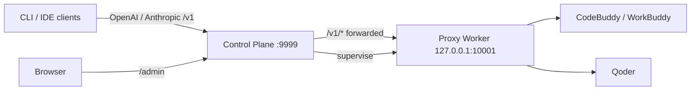

# qoderbuddy2api

<p align="center">
  <b>Local multi-account model gateway + operations console for CodeBuddy &amp; Qoder</b>
  <br/>
  One OpenAI / Anthropic compatible endpoint, an encrypted account pool, and
  daily check-in automation — all behind a loopback-only Control Plane.
</p>

<p align="center">
  <a href="#features">Features</a> ·
  <a href="#quick-start">Quick start</a> ·
  <a href="#client-usage">Client usage</a> ·
  <a href="#documentation">Documentation</a> ·
  <a href="README.zh.md">中文</a>
</p>

<p align="center">
  
  
  
</p>

> A trusted-operator tool for a Mac Mini or dev machine — not a public
> multi-tenant gateway. Worker stays loopback-only; credentials stay encrypted.

## Features

- **Unified model gateway** — one base URL (`/v1`) serves OpenAI and Anthropic
  compatible clients; requests are routed across CodeBuddy and Qoder account
  pools with pre-first-token failover.
- **Encrypted account pool** — durable accounts, purpose-scoped credentials
  (chat / check-in), versioned rotation, and an admin console to import,
  verify, and promote accounts.
- **Daily automation** — scheduled check-in, growth-center task/lottery/travel
  automation, and a decoupled **login automation** (one WorkBuddy conversation
  per day per account to keep the streak alive, with post-run upstream
  verification and a manual retry button).
- **Observability** — token usage rollups, credit/points history charts,
  request events, audit log, and SQLite backups with restore validation.
- **Safety by default** — three separate keys (proxy / admin / credential),
  loopback-only Worker, no raw tokens in logs, URLs, or browser storage.

## Architecture



The **Control Plane** is the only persistent service: admin UI, SQLite,
encrypted credentials, schedulers, backups, and Worker supervision. The
**Proxy Worker** is a supervised child process that only listens on loopback
and never touches SQLite or the admin/credential keys.

## Quick start

Requires Python 3.11+.

```bash
git clone https://github.com/dmego/qoderbuddy2api.git
cd qoderbuddy2api
python3 -m venv .venv
.venv/bin/pip install -e '.[dev]'
cp .env.example .env
chmod 600 .env
mkdir -p data logs && chmod 700 data logs
```

Generate **three distinct** values and put them in `.env`:

```bash
.venv/bin/python -c 'import secrets; print(secrets.token_urlsafe(32))'
.venv/bin/python -c 'import secrets; print(secrets.token_urlsafe(32))'
.venv/bin/python -c 'from cryptography.fernet import Fernet; print(Fernet.generate_key().decode())'
```

Start from the repository root (so `.env` is picked up):

```bash
.venv/bin/qb2api --mode control
```

Then open <http://127.0.0.1:9999/admin/> and log in with `QB2API_ADMIN_KEY`.
The Worker is started automatically.

> Full configuration reference, remote-access snippets, and service templates:
> [Configuration guide](docs/configuration.md) ·
> [Mac Mini deployment](docs/deployment/macmini.md).

## Client usage

Point any OpenAI / Anthropic compatible client at the unified entry:

```text
Base URL: http://127.0.0.1:9999/v1
API Key:  QB2API_PROXY_API_KEY
```

```bash
curl http://127.0.0.1:9999/v1/chat/completions \
  -H "Authorization: Bearer $QB2API_PROXY_API_KEY" \
  -H "Content-Type: application/json" \
  -d '{"model": "deepseek-v4-flash", "messages": [{"role": "user", "content": "你好"}]}'
```

Model IDs are canonical lowercase names (e.g. `deepseek-v4-flash`, `glm-5.2`,
`qwen3.7-max`); shared models are exposed once and routed internally.

## Documentation

| Doc | Contents |
| --- | --- |
| [Configuration guide](docs/configuration.md) | Keys, `.env` reference, remote access, client examples |
| [Mac Mini deployment](docs/deployment/macmini.md) | Install, launchd/systemd, backup & restore, account onboarding |
| [Architecture design](docs/design/macmini-multi-account-proxy-checkin.md) | Original architecture and security baseline |

## Development

```bash
pytest -q
ruff check src tests
python -m compileall -q src/qb2api
cd frontend && npm run test && npm run typecheck && npm run lint && npm run build
git diff --check
```

## License

MIT — see [LICENSE](LICENSE).
