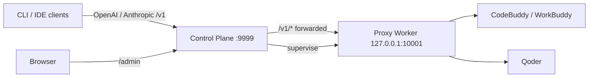

# qoderbuddy2api

<p align="center">
  <b>Self-hosted multi-account model gateway for CodeBuddy &amp; Qoder</b>
  <br/>
  One OpenAI / Anthropic compatible endpoint in front of an encrypted account
  pool, with daily check-in and growth automation — operated from a local
  admin console.
</p>

<p align="center">
  <a href="#features">Features</a> ·
  <a href="#quick-start">Quick start</a> ·
  <a href="#docker-deployment">Docker deployment</a> ·
  <a href="#client-usage">Client usage</a> ·
  <a href="#documentation">Documentation</a> ·
  <a href="README.zh.md">中文</a>
</p>

<p align="center">
  
  
  
  
  
</p>

> **A trusted-operator tool.** This project is designed for a single operator
> on their own machine or private server — it is **not** a public multi-tenant
> gateway. The proxy Worker stays loopback-only and credentials are encrypted
> at rest.

## Features

- **Unified model gateway** — one base URL (`/v1`) serves OpenAI and Anthropic
  compatible clients; requests are routed across CodeBuddy and Qoder account
  pools with failover before the first output token.
- **Encrypted account pool** — durable accounts, purpose-scoped credentials
  (chat / check-in), versioned rotation, and an admin console to import,
  verify, and promote accounts.
- **Model catalog management** — unified lower-case model IDs across providers
  (shared models exposed once), with one-click upstream sync: Qoder via its
  official catalog API and WorkBuddy via live probing of new models.
- **Daily automation** — scheduled check-in, growth-center task / lottery /
  travel automation, and a decoupled **login automation** (one WorkBuddy
  conversation per account per day to keep the streak alive, with post-run
  upstream verification and a manual retry button).
- **Observability** — token usage rollups, credit / points history charts,
  request events, audit log, and SQLite backups with restore validation.
- **Safety by default** — three separate keys (proxy / admin / credential),
  loopback-only Worker, no raw tokens in logs, URLs, or browser storage.

## Architecture



The **Control Plane** is the only persistent service: admin UI, SQLite,
encrypted credentials, schedulers, backups, and Worker supervision. The
**Proxy Worker** is a supervised child process that only listens on loopback
and never touches SQLite or the admin / credential keys.

## Quick start

The recommended way to run qoderbuddy2api is Docker (see
[Docker deployment](#docker-deployment)). To run from source (Python 3.11+):

```bash
git clone https://github.com/dmego/qoderbuddy2api.git
cd qoderbuddy2api
python3 -m venv .venv
.venv/bin/pip install -e '.[dev]'
cp .env.example .env
chmod 600 .env
mkdir -p data logs && chmod 700 data logs
```

Generate **three distinct** values and put them in `.env`:

```bash
python3 -c 'import secrets; print(secrets.token_urlsafe(32))'   # QB2API_PROXY_API_KEY
python3 -c 'import secrets; print(secrets.token_urlsafe(32))'   # QB2API_ADMIN_KEY
python3 -c 'from cryptography.fernet import Fernet; print(Fernet.generate_key().decode())'  # QB2API_CREDENTIAL_KEY
```

Start from the repository root (so `.env` is picked up):

```bash
.venv/bin/qb2api --mode control
```

Then open <http://127.0.0.1:9999/admin/> and log in with `QB2API_ADMIN_KEY`.
The Worker is started automatically.

## Docker deployment

Official images are published to GHCR on every release tag and on every push
to `main`, for both `linux/amd64` and `linux/arm64`:

```text
ghcr.io/dmego/qoderbuddy2api:1.0.0   # release (pinned)
ghcr.io/dmego/qoderbuddy2api:latest  # latest release
ghcr.io/dmego/qoderbuddy2api:edge    # rolling build from main
```

### docker-compose (recommended)

Use the [`docker-compose.yml`](docker-compose.yml) in the repository root:

```bash
git clone https://github.com/dmego/qoderbuddy2api.git
cd qoderbuddy2api
cp .env.example .env
chmod 600 .env
# fill in QB2API_PROXY_API_KEY / QB2API_ADMIN_KEY / QB2API_CREDENTIAL_KEY
docker compose up -d
```

Ports and mounted state:

| Item | Value | Notes |
| --- | --- | --- |
| Control Plane / unified `/v1` | `9999` | only published port; admin console at `/admin` |
| Proxy Worker | `10001` | loopback inside the container, never published |
| `./data` | → `/data` | SQLite, `worker.internal`, backups |
| `./logs` | → `/logs` | request / service logs |
| `./config` | → `/config` | `models.json` model catalog |
| `.env` | → container env | full configuration, passed verbatim |

The Worker internal token is auto-generated into `./data/worker.internal`
(0600) on first start. `restart: unless-stopped` re-launches the container
after a host reboot. Only port `9999` is exposed; the loopback Worker stays
inside the container.

### Plain docker run

```bash
docker run -d --name qb2api-control \
  --env-file .env \
  -e QB2API_CONTROL_HOST=0.0.0.0 \
  -e QB2API_DATA_DIR=/data \
  -e QB2API_LOG_DIR=/logs \
  -e QB2API_MODEL_CONFIG=/config/models.json \
  -p 9999:9999 \
  -v "$PWD/data:/data" \
  -v "$PWD/logs:/logs" \
  -v "$PWD/config:/config" \
  --restart unless-stopped \
  ghcr.io/dmego/qoderbuddy2api:latest
```

> Note: `QB2API_CONTROL_HOST` must be `0.0.0.0` inside the container so the
> published port works.

## Client usage

Point any OpenAI / Anthropic compatible client at the unified entry:

```text
Base URL: http://127.0.0.1:9999/v1
API Key:  QB2API_PROXY_API_KEY
```

```bash
curl http://127.0.0.1:9999/v1/chat/completions \
  -H "Authorization: Bearer $QB2API_PROXY_API_KEY" \
  -H "Content-Type: application/json" \
  -d '{"model": "deepseek-v4-flash", "messages": [{"role": "user", "content": "你好"}]}'
```

Model IDs are canonical lowercase names (e.g. `deepseek-v4-flash`, `glm-5.2`,
`qwen3.7-max`); shared models are exposed once and routed internally. The
admin console at `http://127.0.0.1:9999/admin/` lets you import accounts,
sync the model catalog from upstream, and run check-in / growth automation.

## Documentation

| Doc | Contents |
| --- | --- |
| [Configuration guide](docs/configuration.md) | Keys, `.env` reference, remote access, client examples |
| [Architecture](docs/design/architecture.md) | System architecture and security model |

## Development

```bash
pytest -q
ruff check src tests
python -m compileall -q src/qb2api
cd frontend && npm run test && npm run typecheck && npm run lint && npm run build
git diff --check
```

## License

MIT — see [LICENSE](LICENSE).
