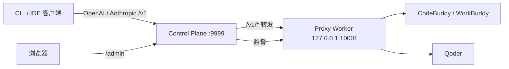

# qoderbuddy2api

<p align="center">
  <b>CodeBuddy / Qoder 多账号本地模型网关 + 运维控制台</b>
  <br/>
  一个 OpenAI / Anthropic 兼容入口、加密账号池、每日签到与登录自动化，
  全部收敛在仅监听 loopback 的 Control Plane 之后。
</p>

<p align="center">
  <a href="#功能特性">功能特性</a> ·
  <a href="#快速开始">快速开始</a> ·
  <a href="#客户端接入">客户端接入</a> ·
  <a href="#文档">文档</a> ·
  <a href="README.md">English</a>
</p>

<p align="center">
  
  
  
</p>

> 面向 Mac Mini 或开发机上的一位可信运维者 —— 不是公网多租户网关。
> Worker 默认仅监听 loopback，凭据全程加密存储。

## 功能特性

- **统一模型网关** —— 单一 base URL（`/v1`）同时服务 OpenAI 与 Anthropic 兼容客户端；
  CodeBuddy 与 Qoder 账号池轮询路由，首个输出前自动故障转移。
- **加密账号池** —— 持久账号、按用途隔离的凭据（chat / check-in）、版本化轮换，
  管理台可导入、验证、提升账号。
- **每日自动化** —— 定时签到、成长中心任务/抽奖/旅行自动化，以及解耦的
  **登录自动化**（每账号每天一次 WorkBuddy 对话点亮连登，带上游后置确认与手动重试）。
- **可观测性** —— Token 用量聚合、积分历史曲线、请求事件、审计日志、
  SQLite 备份与恢复校验。
- **默认安全** —— Proxy / Admin / Credential 三把独立密钥，Worker 仅 loopback，
  原始 token 不进日志、URL 或浏览器存储。

## 架构



**Control Plane** 是唯一常驻服务：管理台、SQLite、加密凭据、调度器、备份与 Worker
监督。**Proxy Worker** 是受管子进程，只监听 loopback，不访问 SQLite，不持有
Admin Key 或凭据加密主密钥。

## 快速开始

需要 Python 3.11 及以上。

```bash
git clone https://github.com/dmego/qoderbuddy2api.git
cd qoderbuddy2api
python3 -m venv .venv
.venv/bin/pip install -e '.[dev]'
cp .env.example .env
chmod 600 .env
mkdir -p data logs && chmod 700 data logs
```

生成**三份互不相同**的随机值填入 `.env`：

```bash
.venv/bin/python -c 'import secrets; print(secrets.token_urlsafe(32))'
.venv/bin/python -c 'import secrets; print(secrets.token_urlsafe(32))'
.venv/bin/python -c 'from cryptography.fernet import Fernet; print(Fernet.generate_key().decode())'
```

从仓库根目录启动（以便读取 `.env`）：

```bash
.venv/bin/qb2api --mode control
```

然后打开 <http://127.0.0.1:9999/admin/>，用 `QB2API_ADMIN_KEY` 登录。Worker 自动启动。

> 完整配置参考、远程访问片段与服务模板：
> [配置指南](docs/configuration.md) ·
> [Mac Mini 部署手册](docs/deployment/macmini.md)。

## 客户端接入

任意 OpenAI / Anthropic 兼容客户端指向统一入口：

```text
Base URL: http://127.0.0.1:9999/v1
API Key:  QB2API_PROXY_API_KEY
```

```bash
curl http://127.0.0.1:9999/v1/chat/completions \
  -H "Authorization: Bearer $QB2API_PROXY_API_KEY" \
  -H "Content-Type: application/json" \
  -d '{"model": "deepseek-v4-flash", "messages": [{"role": "user", "content": "你好"}]}'
```

模型 ID 为统一小写规范名（如 `deepseek-v4-flash`、`glm-5.2`、`qwen3.7-max`）；
共有模型只暴露一个条目，请求在内部按提供商路由。

## 文档

| 文档 | 内容 |
| --- | --- |
| [配置指南](docs/configuration.md) | 密钥、`.env` 参考、远程访问、客户端示例 |
| [Mac Mini 部署与运维](docs/deployment/macmini.md) | 安装、launchd/systemd、备份恢复、账号导入 |
| [单进程迁移](docs/migration/single-process-to-control-worker.md) | 从旧单进程架构迁移 |
| [Qoder 签到导出器](tools/qoder-checkin-exporter/README.md) | Windows QoderWork 凭据导出流程 |
| [架构设计](docs/design/macmini-multi-account-proxy-checkin.md) | 原始架构与安全基线 |

## 开发验证

```bash
pytest -q
ruff check src tests
python -m compileall -q src/qb2api
cd frontend && npm run test && npm run typecheck && npm run lint && npm run build
git diff --check
```

## 许可证

MIT — 见 [LICENSE](LICENSE)。
