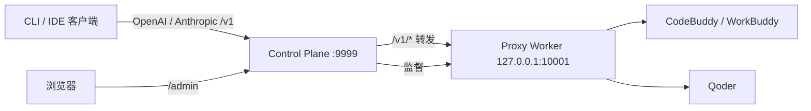

# qoderbuddy2api

<p align="center">
  <b>CodeBuddy / Qoder 多账号自托管模型网关</b>
  <br/>
  一个 OpenAI / Anthropic 兼容入口 + 加密账号池，内置每日签到与成长自动化，
  全部通过本地运维控制台管理。
</p>

<p align="center">
  <a href="#功能特性">功能特性</a> ·
  <a href="#快速开始">快速开始</a> ·
  <a href="#docker-部署">Docker 部署</a> ·
  <a href="#客户端接入">客户端接入</a> ·
  <a href="#文档">文档</a> ·
  <a href="README.md">English</a>
</p>

<p align="center">
  
  
  
  
  
</p>

> **面向可信运维者**：本项目为单运维者在自己机器或私有服务器上运行而设计，
> **不是**公网多租户网关。Proxy Worker 仅监听 loopback，凭据加密落盘。

## 功能特性

- **统一模型网关** —— 单一 base URL（`/v1`）同时服务 OpenAI 与 Anthropic 兼容客户端；
  CodeBuddy 与 Qoder 账号池轮询路由，首个输出前自动故障转移。
- **加密账号池** —— 持久账号、按用途隔离的凭据（chat / check-in）、版本化轮换，
  管理台可导入、验证、提升账号。
- **模型目录管理** —— 跨提供商统一小写模型 ID（共有模型只暴露一条），一键上游同步：
  Qoder 走官方目录接口，WorkBuddy 通过实时探测发现新模型。
- **每日自动化** —— 定时签到、成长中心任务/抽奖/旅行自动化，以及解耦的
  **登录自动化**（每账号每天一次 WorkBuddy 对话点亮连登，带上游后置确认与手动重试）。
- **可观测性** —— Token 用量聚合、积分历史曲线、请求事件、审计日志、
  SQLite 备份与恢复校验。
- **默认安全** —— Proxy / Admin / Credential 三把独立密钥，Worker 仅 loopback，
  原始 token 不进日志、URL 或浏览器存储。

## 架构



**Control Plane** 是唯一常驻服务：管理台、SQLite、加密凭据、调度器、备份与 Worker
监督。**Proxy Worker** 是受管子进程，只监听 loopback，不访问 SQLite，不持有
Admin Key 或凭据加密主密钥。

## 快速开始

推荐使用 Docker 运行（见 [Docker 部署](#docker-部署)）。从源码运行需要 Python 3.11+：

```bash
git clone https://github.com/dmego/qoderbuddy2api.git
cd qoderbuddy2api
python3 -m venv .venv
.venv/bin/pip install -e '.[dev]'
cp .env.example .env
chmod 600 .env
mkdir -p data logs && chmod 700 data logs
```

生成**三份互不相同**的随机值填入 `.env`：

```bash
python3 -c 'import secrets; print(secrets.token_urlsafe(32))'   # QB2API_PROXY_API_KEY
python3 -c 'import secrets; print(secrets.token_urlsafe(32))'   # QB2API_ADMIN_KEY
python3 -c 'from cryptography.fernet import Fernet; print(Fernet.generate_key().decode())'  # QB2API_CREDENTIAL_KEY
```

从仓库根目录启动（以便读取 `.env`）：

```bash
.venv/bin/qb2api --mode control
```

然后打开 <http://127.0.0.1:9999/admin/>，用 `QB2API_ADMIN_KEY` 登录。Worker 自动启动。

## Docker 部署

官方镜像在每次打发布 tag 与每次推送 `main` 时自动构建并推送到 GHCR，
同时支持 `linux/amd64` 与 `linux/arm64`：

```text
ghcr.io/dmego/qoderbuddy2api:1.0.0   # 发布版（固定版本）
ghcr.io/dmego/qoderbuddy2api:latest  # 最新发布版
ghcr.io/dmego/qoderbuddy2api:edge    # main 滚动构建
```

### docker-compose（推荐）

使用仓库根目录的 [`docker-compose.yml`](docker-compose.yml)：

```bash
git clone https://github.com/dmego/qoderbuddy2api.git
cd qoderbuddy2api
cp .env.example .env
chmod 600 .env
# 填入 QB2API_PROXY_API_KEY / QB2API_ADMIN_KEY / QB2API_CREDENTIAL_KEY
docker compose up -d
```

端口与数据外挂：

| 项 | 值 | 说明 |
| --- | --- | --- |
| Control Plane / 统一 `/v1` | `9999` | 唯一对外端口；管理台在 `/admin` |
| Proxy Worker | `10001` | 容器内 loopback，永不对外发布 |
| `./data` | → `/data` | SQLite、`worker.internal`、备份 |
| `./logs` | → `/logs` | 请求 / 服务日志 |
| `./config` | → `/config` | 模型目录 `models.json` |
| `.env` | → 容器环境变量 | 完整配置原样传入 |

Worker 内部 token 首次启动自动生成到 `./data/worker.internal`（0600）。
`restart: unless-stopped` 保证宿主机重启后自动拉起；仅暴露 9999，
loopback Worker 留在容器内。

### 直接 docker run

```bash
docker run -d --name qb2api-control \
  --env-file .env \
  -e QB2API_CONTROL_HOST=0.0.0.0 \
  -e QB2API_DATA_DIR=/data \
  -e QB2API_LOG_DIR=/logs \
  -e QB2API_MODEL_CONFIG=/config/models.json \
  -p 9999:9999 \
  -v "$PWD/data:/data" \
  -v "$PWD/logs:/logs" \
  -v "$PWD/config:/config" \
  --restart unless-stopped \
  ghcr.io/dmego/qoderbuddy2api:latest
```

> 注意：容器内 `QB2API_CONTROL_HOST` 必须为 `0.0.0.0`，发布端口才能生效。

## 客户端接入

任意 OpenAI / Anthropic 兼容客户端指向统一入口：

```text
Base URL: http://127.0.0.1:9999/v1
API Key:  QB2API_PROXY_API_KEY
```

```bash
curl http://127.0.0.1:9999/v1/chat/completions \
  -H "Authorization: Bearer $QB2API_PROXY_API_KEY" \
  -H "Content-Type: application/json" \
  -d '{"model": "deepseek-v4-flash", "messages": [{"role": "user", "content": "你好"}]}'
```

模型 ID 为统一小写规范名（如 `deepseek-v4-flash`、`glm-5.2`、`qwen3.7-max`）；
共有模型只暴露一个条目，请求在内部按提供商路由。管理台
`http://127.0.0.1:9999/admin/` 可导入账号、从上游同步模型目录、执行签到与成长自动化。

## 文档

| 文档 | 内容 |
| --- | --- |
| [配置指南](docs/configuration.md) | 密钥、`.env` 参考、远程访问、客户端示例 |
| [架构设计](docs/design/architecture.md) | 系统架构与安全模型 |

## 开发验证

```bash
pytest -q
ruff check src tests
python -m compileall -q src/qb2api
cd frontend && npm run test && npm run typecheck && npm run lint && npm run build
git diff --check
```

## 许可证

MIT — 见 [LICENSE](LICENSE)。
